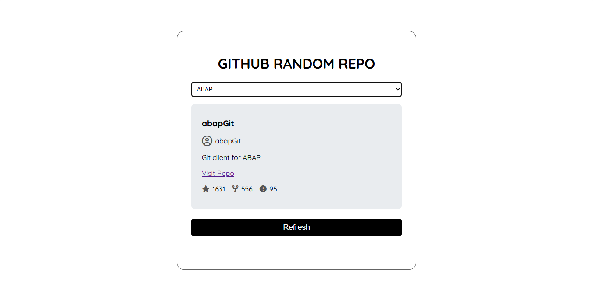

# Roadmap.sh Random GitHub Repository Finder

This project is an integration for [roadmap.sh](https://roadmap.sh) that allows users to discover a random GitHub repository using the GitHub Search API. It provides a fun and interactive way for developers to explore open-source projects and expand their knowledge.

## Features

- Fetches a random public GitHub repository using the [GitHub Search API](https://docs.github.com/en/rest/reference/search#search-repositories)
- Displays repository details such as name, description, stars, forks, and number of open issues
- Option to open the repository directly on GitHub
- Simple and intuitive UI for fast exploration

## How It Works

1. The application queries the GitHub Search API with a randomized search term or sorting order to ensure randomness.
2. It parses the results and selects a repository at random.
3. The repository information is displayed to the user with a direct link to the repository page.

## Getting Started

### Prerequisites

- Any modern web browser

### Usage

1. Download or clone this repository.
2. Open the `index.html` file directly in your browser.
   - Alternatively, you can use a tool like [Live Server](https://marketplace.visualstudio.com/items?itemName=ritwickdey.LiveServer) for automatic reloading during development.
3. Select a programming language to fetch and display a random GitHub repository.
4. Browse the repository details and click the link to view it on GitHub.
5. Use the app to discover new projects and inspire your open-source journey!

## Example

## Technologies Used

- HTML, CSS, JavaScript (Vanilla)
- GitHub REST API v3

## API Reference

- [GitHub Search API: Search repositories](https://docs.github.com/en/rest/reference/search#search-repositories)

## Contributing

Contributions are welcome! Please open an issue or submit a pull request for improvements and new features.

---

Powered by [roadmap.sh](https://roadmap.sh) and GitHub.
